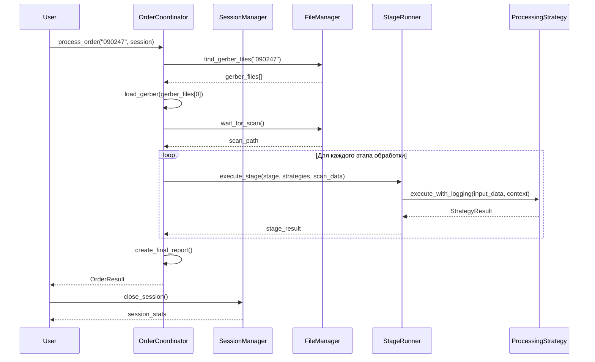
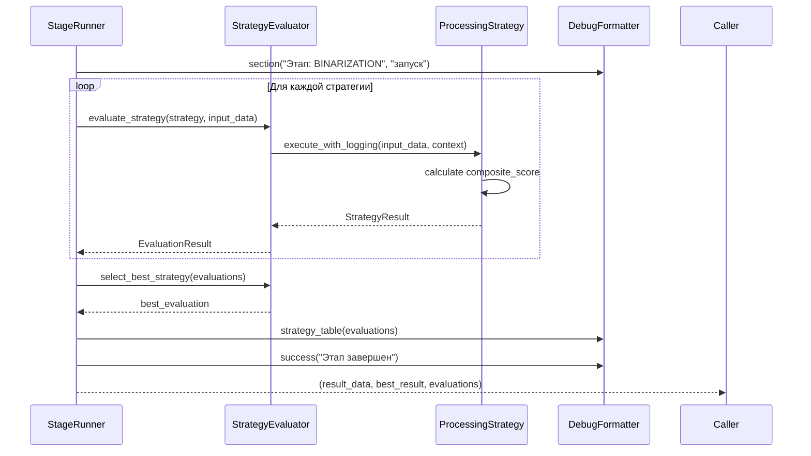
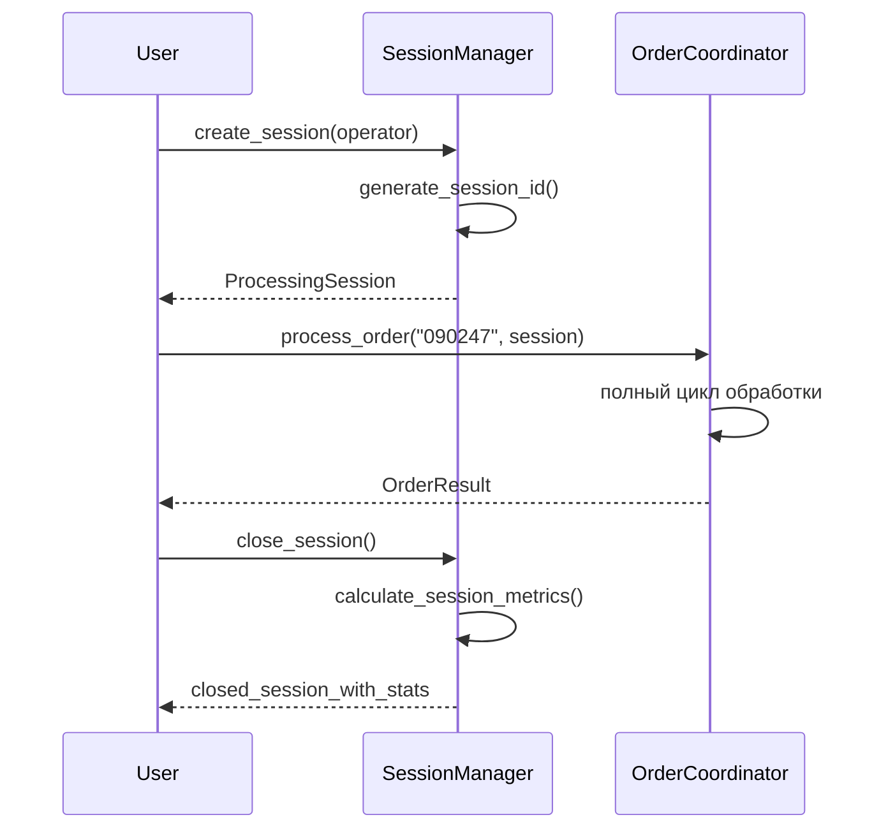

# API Documentation: Stencil Analyzer System

## 🏗️ Архитектурный обзор

Система построена по принципам **чистой архитектуры** с четким разделением на уровни:

```
┌─────────────────────────────────────────────────────────────┐
│                    Уровень приложения                       │
│  OrderCoordinator ────── SessionManager                    │
└─────────────────────────────────────────────────────────────┘
┌─────────────────────────────────────────────────────────────┐
│                 Уровень бизнес-логики                       │
│  StageRunner ────────────── StrategyEvaluator              │
└─────────────────────────────────────────────────────────────┘
┌─────────────────────────────────────────────────────────────┐
│                    Доменный уровень                         │
│  Data Models ────────────── ProcessingStrategy             │
└─────────────────────────────────────────────────────────────┘
┌─────────────────────────────────────────────────────────────┐
│                 Инфраструктурный уровень                    │
│  ConfigService ── FileManager ── UIService ── Logging      │
└─────────────────────────────────────────────────────────────┘
```

## 📋 Содержание

- [1. Уровень приложения](#1-уровень-приложения)
  - [1.1 OrderCoordinator](#11-ordercoordinator)
  - [1.2 SessionManager](#12-sessionmanager)
- [2. Уровень бизнес-логики](#2-уровень-бизнес-логики)
  - [2.1 StageRunner](#21-stagerunner)
- [3. Доменный уровень](#3-доменный-уровень)
  - [3.1 Data Models](#31-data-models)
  - [3.2 ProcessingStrategy](#32-processingstrategy)
- [4. Инфраструктурный уровень](#4-инфраструктурный-уровень)
  - [4.1 ConfigService](#41-configservice)
- [Примеры использования](#примеры-использования)
- [Диаграммы последовательностей](#диаграммы-последовательностей)

---

## 1. Уровень приложения

### 1.1 OrderCoordinator

**Назначение:** Главный координатор обработки заказов, управляет полным workflow системы.

```python
class OrderCoordinator:
    def __init__(self, config_service: ConfigService, ui_service: UIService, file_manager: FileManager)
```

#### `process_order()`

```python
def process_order(self, order_number: str, session: ProcessingSession) -> OrderResult
```

**Параметры:**
| Параметр | Тип | Обязательный | Описание | По умолчанию |
|----------|-----|--------------|----------|--------------|
| `order_number` | `str` | ✅ | 6-значный номер заказа | - |
| `session` | `ProcessingSession` | ✅ | Активная сессия обработки | - |

**Контракт:**

- Выполняет полный цикл обработки заказа согласно 8-этапному пайплайну
- Координирует поиск Gerber-файлов, ожидание сканов, обработку и визуализацию
- Обрабатывает ошибки на всех этапах с предоставлением вариантов действий
- Создает финальные отчеты и сохраняет результаты

**Возвращает:** `OrderResult` - агрегированные результаты обработки заказа

**Workflow:**

1. 🔍 Поиск и анализ Gerber-файла
2. 📥 Ожидание скана трафарета
3. 🖼️ Обработка изображения через StageRunner
4. 🔄 Совмещение с эталоном
5. 📊 Создание финального отчета

**Пример использования:**

```python
coordinator = OrderCoordinator(config, ui_service, file_manager)
result = coordinator.process_order("090247", current_session)

if result.success_count > 0:
    print(f"✅ Заказ обработан успешно. Качество: {result.overall_quality_score:.3f}")
```

### 1.2 SessionManager

**Назначение:** Управление сессиями работы операторов, отслеживание метрик производительности.

```python
class SessionManager:
    def __init__(self, config_service: Optional[ConfigService] = None)
```

#### `create_session()`

```python
def create_session(self, operator: Operator) -> ProcessingSession
```

**Параметры:**
| Параметр | Тип | Обязательный | Описание |
|----------|-----|--------------|----------|
| `operator` | `Operator` | ✅ | Данные оператора для сессии |

**Контракт:**

- Создает уникальную сессию с автоматической генерацией ID
- Автоматически закрывает предыдущую активную сессию
- Инициализирует временные метки начала работы
- Валидирует данные оператора

**Возвращает:** `ProcessingSession` - созданная сессия с уникальным ID

#### `close_session()`

```python
def close_session(self) -> Optional[ProcessingSession]
```

**Контракт:**

- Устанавливает время окончания сессии
- Генерирует статистику производительности
- Очищает ссылку на текущую сессию
- Сохраняет метрики для отчетности

**Возвращает:** `Optional[ProcessingSession]` - закрытая сессия с полной статистикой

#### `get_session_stats()`

```python
def get_session_stats(self) -> dict
```

**Возвращает:** `dict` - текущая статистика сессии

**Структура возврата:**

```python
{
    'session_id': 'operator_20241205_143025',
    'operator': 'Иванов И.И.',
    'duration_minutes': '45.2',
    'total_orders': 8,
    'total_scans': 12,
    'successful_scans': 11,
    'success_rate': '91.7%'
}
```

**Пример использования:**

```python
session_manager = SessionManager(config)
operator = Operator(id="123", full_name="Иванов И.И.")

# Создание сессии
session = session_manager.create_session(operator)

# Работа с заказами...
order_result = coordinator.process_order("090247", session)

# Закрытие сессии с получением статистики
closed_session = session_manager.close_session()
print(f"Обработано заказов: {closed_session.total_orders}")
```

---

## 2. Уровень бизнес-логики

### 2.1 StageRunner

**Назначение:** Менеджер выполнения отдельных этапов обработки с системой оценки стратегий.

```python
class StageRunner:
    def __init__(self, config_service: ConfigService)
```

#### `execute_stage()`

```python
def execute_stage(self,
                 stage: PipelineStage,
                 strategies: List[ProcessingStrategy],
                 input_data: Any,
                 context: Dict[str, Any],
                 callback: Optional[Callable] = None
                 ) -> Tuple[Any, EvaluationResult, List[EvaluationResult]]
```

**Параметры:**
| Параметр | Тип | Обязательный | Описание |
|----------|-----|--------------|----------|
| `stage` | `PipelineStage` | ✅ | Этап пайплайна для выполнения |
| `strategies` | `List[ProcessingStrategy]` | ✅ | Список стратегий для оценки |
| `input_data` | `Any` | ✅ | Входные данные для обработки |
| `context` | `Dict[str, Any]` | ✅ | Контекст выполнения |
| `callback` | `Optional[Callable]` | ❌ | Колбэк для инкрементальной визуализации |

**Контракт:**

- Выполняет оценку всех предоставленных стратегий через `StrategyEvaluator`
- Выбирает оптимальную стратегию на основе метрик качества
- Обеспечивает структурированное логирование процесса
- Поддерживает инкрементальную визуализацию через callback
- Гарантирует обработку ошибок на уровне стратегий

**Возвращает:** `Tuple[Any, EvaluationResult, List[EvaluationResult]]`

- `result_data`: Данные для передачи следующему этапу
- `best_result`: Лучшая оцененная стратегия этапа
- `evaluations`: Все результаты оценки для анализа

**Пример использования:**

```python
stage_runner = StageRunner(config_service)

# Подготовка стратегий для этапа бинаризации
strategies = [
    AdaptiveOtsuStrategy("otsu_adaptive"),
    GlobalThresholdStrategy("global_thresh")
]

context = {
    "debug_mode": True,
    "order_number": "090247",
    "session_id": session.session_id
}

# Выполнение этапа
result_data, best_result, all_evaluations = stage_runner.execute_stage(
    stage=PipelineStage.BINARIZATION,
    strategies=strategies,
    input_data=scan_image,
    context=context
)

print(f"Лучшая стратегия: {best_result.strategy_name}")
```

---

## 3. Доменный уровень

### 3.1 Data Models

#### Ключевые модели данных:

**ProcessingSession** - сессия работы оператора

```python
@dataclass
class ProcessingSession:
    session_id: str
    operator: Operator
    start_time: datetime
    end_time: Optional[datetime] = None
    orders_processed: Dict[str, OrderResult] = field(default_factory=dict)
```

**OrderResult** - результаты обработки заказа

```python
@dataclass
class OrderResult:
    order_number: str
    processed_scans: List[ProcessedScan]
    board_size: str = ""
    polygon_count: int = 0
    processing_errors: List[str] = field(default_factory=list)
    next_action: Optional[str] = None
```

**StrategyResult** - результат выполнения стратегии

```python
@dataclass
class StrategyResult:
    strategy_name: str
    success: bool
    result_data: Any
    metrics: Dict[str, Any]  # Обязательно содержит composite_score
    processing_time: float
    error_message: Optional[str] = None
    artifacts: Dict[str, np.ndarray] = field(default_factory=dict)
    stage: Optional[PipelineStage] = None
```

### 3.2 ProcessingStrategy

**Назначение:** Базовый абстрактный класс для всех стратегий обработки изображений.

```python
class ProcessingStrategy(ABC):
    def __init__(self, name: str, config: Optional[Dict[str, Any]] = None)
```

#### `execute_with_logging()`

```python
def execute_with_logging(self, input_data: Any, context: Dict[str, Any]) -> StrategyResult
```

**Параметры:**
| Параметр | Тип | Обязательный | Описание |
|----------|-----|--------------|----------|
| `input_data` | `Any` | ✅ | Входные данные для обработки |
| `context` | `Dict[str, Any]` | ✅ | Контекст выполнения |

**Контракт:**

- Гарантирует полное логирование выполнения стратегии
- Обеспечивает наличие `composite_score` в возвращаемых метриках
- Обрабатывает исключения с детальным логированием
- Возвращает стандартизированный `StrategyResult`

**Возвращает:** `StrategyResult` - результат выполнения с гарантированными метриками

#### `is_applicable()`

```python
def is_applicable(self, input_data: Any, context: Dict[str, Any]) -> bool
```

**Контракт:**

- Проверяет возможность применения стратегии к данным
- Может анализировать характеристики входных данных
- Возвращает булево значение применимости

**Возвращает:** `bool` - может ли стратегия быть применена

**Пример реализации стратегии:**

```python
class AdaptiveOtsuStrategy(BinarizationStrategy):
    def execute(self, input_data: np.ndarray, context: Dict[str, Any]) -> StrategyResult:
        start_time = time.time()

        try:
            # Логика обработки
            processed_image = self._apply_adaptive_otsu(input_data)

            # Расчет метрик с гарантированным composite_score
            metrics = self._calculate_metrics(input_data, processed_image)

            return StrategyResult(
                strategy_name=self.name,
                success=True,
                result_data=processed_image,
                metrics=metrics,
                processing_time=time.time() - start_time
            )
        except Exception as e:
            return StrategyResult(
                strategy_name=self.name,
                success=False,
                result_data=None,
                metrics={},
                processing_time=time.time() - start_time,
                error_message=str(e)
            )
```

---

## 4. Инфраструктурный уровень

### 4.1 ConfigService

**Назначение:** Централизованное управление конфигурацией системы.

```python
class ConfigService:
    def __init__(self, config_file: str = 'config.ini', debug_mode: bool = False) -> None
```

#### `get_evaluator_config()`

```python
def get_evaluator_config(self) -> Dict[str, Any]
```

**Контракт:**

- Предоставляет конфигурацию для системы оценки стратегий
- Включает пороги качества и коэффициенты коррекции

**Возвращает:** `Dict[str, Any]` - конфигурация оценщика

**Структура возврата:**

```python
{
    'quality_thresholds': {
        'preprocessing': 0.5,
        'binarization': 0.4,
        'roi_extraction': 0.5,
        'alignment': 0.5
    },
    'boost_factor': 1.3,
    'penalty_factor': 0.7,
    'min_boundary_match_threshold': 0.3
}
```

#### `get_pipeline_config()`

```python
def get_pipeline_config(self) -> Dict[str, Any]
```

**Контракт:**

- Предоставляет настройки для пайплайна обработки
- Включает параметры отладки и стратегии выполнения

**Возвращает:** `Dict[str, Any]` - конфигурация пайплайна

#### `get_filename()`

```python
def get_filename(self, template: str, order_number: str, workspace: Path) -> Path
```

**Параметры:**
| Параметр | Тип | Обязательный | Описание |
|----------|-----|--------------|----------|
| `template` | `str` | ✅ | Шаблон имени файла |
| `order_number` | `str` | ✅ | Номер заказа для подстановки |
| `workspace` | `Path` | ✅ | Рабочая директория |

**Контракт:**

- Генерирует уникальные имена файлов с обработкой конфликтов
- Поддерживает стратегии `increment` и `overwrite`
- Гарантирует валидность возвращаемого пути

**Возвращает:** `Path` - полный путь к файлу

**Пример использования:**

```python
config = ConfigService(debug_mode=True)

# Получение конфигурации для компонентов
evaluator_config = config.get_evaluator_config()
pipeline_config = config.get_pipeline_config()

# Генерация имени файла с авто-инкрементом
output_path = config.get_filename(
    template=config.comparison_result_filename,
    order_number="090247",
    workspace=Path("/output")
)
```

---

## Примеры использования

### Полный workflow обработки заказа

```python
# Инициализация сервисов
config = ConfigService()
ui_service = UIService()
file_manager = FileManager(config)

# Создание сессии
session_manager = SessionManager(config)
operator = Operator(id="123", full_name="Иванов И.И.")
session = session_manager.create_session(operator)

# Обработка заказа
coordinator = OrderCoordinator(config, ui_service, file_manager)

try:
    order_result = coordinator.process_order("090247", session)

    # Анализ результатов
    print(f"✅ Успешных сканов: {order_result.success_count}")
    print(f"📊 Общее качество: {order_result.overall_quality_score:.3f}")
    print(f"⏱️ Следующее действие: {order_result.next_action}")

finally:
    # Закрытие сессии с сохранением статистики
    closed_session = session_manager.close_session()
    print(f"📈 Статистика сессии: {closed_session.success_rate:.1f}% успешных")
```

### Создание и тестирование пользовательской стратегии

```python
class CustomBinarizationStrategy(BinarizationStrategy):
    def execute(self, input_data: np.ndarray, context: Dict) -> StrategyResult:
        start_time = time.time()

        try:
            # Пользовательская логика обработки
            processed = self._custom_processing(input_data)

            # Расчет метрик с гарантированным composite_score
            metrics = self._calculate_comprehensive_metrics(input_data, processed)

            return StrategyResult(
                strategy_name=self.name,
                success=True,
                result_data=processed,
                metrics=metrics,
                processing_time=time.time() - start_time
            )
        except Exception as e:
            return self._create_error_result(start_time, str(e))

# Регистрация и тестирование стратегии
custom_strategy = CustomBinarizationStrategy("custom_binarization")
strategies = [custom_strategy, AdaptiveOtsuStrategy("otsu")]

stage_runner = StageRunner(config)
result_data, best_result, evaluations = stage_runner.execute_stage(
    stage=PipelineStage.BINARIZATION,
    strategies=strategies,
    input_data=scan_image,
    context={"debug_mode": True}
)
```

---

## Диаграммы последовательностей

### Полный цикл обработки заказа



### Выполнение этапа обработки



### Управление сессиями



---

## 🔧 Best Practices использования API

### 1. Обработка ошибок

```python
try:
    order_result = coordinator.process_order(order_number, session)

    if order_result.processing_errors:
        print(f"⚠️ Предупреждения: {order_result.processing_errors}")

    if order_result.next_action == "exit":
        break

except RuntimeError as e:
    print(f"❌ Критическая ошибка: {e}")
    # Логирование и восстановление
```

### 2. Мониторинг производительности

```python
# Использование метрик сессии
session_stats = session_manager.get_session_stats()
print(f"Текущая статистика: {session_stats}")

# Анализ качества стратегий
if best_result.quality_score < 0.5:
    print("⚠️ Низкое качество обработки, требуется настройка")
```

### 3. Конфигурация для различных сценариев

```python
# Production конфигурация
config = ConfigService(debug_mode=False)

# Debug конфигурация
debug_config = ConfigService(debug_mode=True)

# Кастомная конфигурация
custom_config = ConfigService("custom_config.ini")
```

Эта документация предоставляет полное описание API системы Stencil Analyzer с учетом архитектурных принципов и лучших практик использования.
