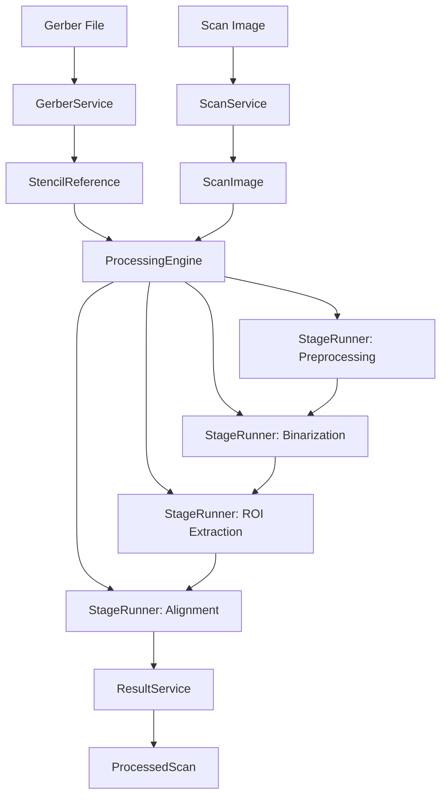

# Архитектура Stencil Analyzer

## 🎯 Обзор системы

Stencil Analyzer - это многоуровневое приложение для автоматического сравнения Gerber-файлов с отсканированными изображениями PCB трафаретов. Архитектура построена по принципам **чистой архитектуры** с четким разделением ответственности между компонентами.

### Ключевые характеристики архитектуры:

- **Многослойность** - разделение на доменный, прикладной и инфраструктурный уровни
- **Модульность** - независимые компоненты с четкими интерфейсами
- **Расширяемость** - плагинная система стратегий обработки
- **Поддерживаемость** - низкая связанность и высокая связность компонентов

## 🏗️ Общая архитектура

### Слои приложения:

```
┌─────────────────────────────────────────────────────────────┐
│                    Уровень приложения                       │
│  StencilAnalyzerApplication ────── OrderCoordinator         │
└─────────────────────────────────────────────────────────────┘
┌─────────────────────────────────────────────────────────────┐
│                 Уровень бизнес-логики                       │
│  ProcessingEngine ────────────── StageRunner                │
└─────────────────────────────────────────────────────────────┘
┌─────────────────────────────────────────────────────────────┐
│                    Доменный уровень                         │
│  Data Models ────────────── Strategy Interfaces             │
└─────────────────────────────────────────────────────────────┘
┌─────────────────────────────────────────────────────────────┐
│                 Инфраструктурный уровень                    │
│  ConfigService ── FileManager ── UIService ── Logging       │
└─────────────────────────────────────────────────────────────┘
```

### Физическая структура проекта:

```
v13_final/
├── app/                    # Уровень приложения
│   ├── application.py      # Главный класс приложения
│   └── session_manager.py  # Управление сессиями
├── domain/                 # Доменные модели и контракты
│   └── data_models.py      # Структуры данных
├── infrastructure/         # Инфраструктурные сервисы
│   ├── config_service.py   # Управление конфигурацией
│   ├── file_manager.py     # Работа с файловой системой
│   ├── ui_service.py       # Пользовательский интерфейс
│   └── logging_service.py  # Логирование
├── order/                  # Управление заказами
│   ├── order_coordinator.py # Координация обработки заказов
│   └── order_manager.py    # Менеджер заказов
├── processing/             # Ядро обработки изображений
│   ├── processing_engine.py # Оркестратор пайплайна
│   ├── gerber_service.py   # Обработка Gerber-файлов
│   ├── scan_service.py     # Работа со сканами
│   ├── stage_runner.py     # Исполнитель этапов
│   └── result_service.py   # Формирование результатов
└── processing/strategies/  # Система стратегий
    ├── strategy_registry.py # Фабрика стратегий
    ├── base_strategies.py  # Базовые классы
    └── [stage]/           # Стратегии по этапам обработки
```

## 🔄 Детальный поток данных

### 1. Инициализация приложения

```
main.py
    → StencilAnalyzerApplication.initialize()
        → ConfigService()           # Загрузка конфигурации
        → UIService()               # Инициализация UI
        → FileManager()             # Настройка файловой системы
        → OrderCoordinator()        # Создание координатора заказов
        → ProcessingEngine()        # Инициализация движка обработки
```

### 2. Обработка заказа

```
OrderCoordinator.process_order()
    → ProcessingEngine.analyze_gerber()     # Анализ Gerber-файла
        → GerberService.analyze_gerber()    # Парсинг Gerber
        → GerberService.rasterize_gerber()  # Растеризация в изображение

    → ProcessingEngine.process_scan()       # Обработка скана
        → ScanService.load_scan()           # Загрузка скана
        → StageRunner.execute_stage()       # Последовательные этапы
            → StrategyRegistry              # Автовыбор стратегий
            → StrategyEvaluator             # Оценка качества
        → ResultService.assemble_and_save() # Сохранение результатов
```

### 3. 8-этапный конвейер обработки

```python
# ProcessingEngine.process_scan() - основной пайплайн
1. Загрузка скана (ScanService)
2. Растеризация Gerber (GerberService)
3. Анализ изображений (ImageAnalyzer)
4. Предобработка (StageRunner + стратегии)
5. Бинаризация (StageRunner + стратегии)
6. ROI Extraction (StageRunner + стратегии)
7. Совмещение (StageRunner + стратегии)
8. Сборка результатов (ResultService)
```

## 🎯 Ключевые компоненты системы

### StencilAnalyzerApplication

**Назначение:** Главный координатор приложения, управляет жизненным циклом

```python
class StencilAnalyzerApplication:
    def initialize() -> bool          # Инициализация всех компонентов
    def run() -> None                 # Основной цикл приложения
    def shutdown() -> None            # Корректное завершение
```

**Ответственность:**

- Управление сессиями операторов
- Координация высокоуровневого workflow
- Обработка пользовательского ввода
- Управление зависимостями между сервисами

### ProcessingEngine

**Назначение:** Оркестратор пайплайна обработки изображений

```python
class ProcessingEngine:
    def analyze_gerber() -> StencilReference    # Анализ Gerber-файла
    def process_scan() -> ProcessedScan         # Обработка скана
    def register_strategy() -> None             # Регистрация стратегий
```

**Ответственность:**

- Координация 8-этапного конвейера обработки
- Управление прогрессом выполнения
- Делегирование задач специализированным сервисам
- Сбор и агрегация результатов

### StageRunner

**Назначение:** Исполнитель отдельных этапов обработки

```python
class StageRunner:
    def execute_stage() -> Tuple[Any, EvaluationResult, List[EvaluationResult]]
```

**Ответственность:**

- Запуск и оценка множества стратегий для этапа
- Выбор оптимальной стратегии на основе метрик качества
- Логирование сравнительных результатов
- Передача контекста между этапами

### StrategyRegistry

**Назначение:** Фабрика для автоматического обнаружения и регистрации стратегий

```python
class StrategyRegistry:
    def register_all_strategies() -> None      # Авторегистрация стратегий
    def get_available_strategies() -> Dict[PipelineStage, List[str]]
```

**Ответственность:**

- Сканирование модулей стратегий
- Создание экземпляров стратегий
- Регистрация в ProcessingEngine
- Кэширование для производительности

## 🏗️ Система стратегий обработки

### Архитектура стратегий:

```
processing/strategies/
├── strategy_registry.py           # Фабрика стратегий
├── base_strategies.py             # Абстрактные базовые классы
├── evaluation.py                  # Оценщик стратегий
├── image_analyzer.py              # Анализатор изображений
├── alignment/                     # Стратегии совмещения
│   ├── base_alignment.py
│   ├── contour_based.py
│   └── global_correlation.py
├── binarization/                  # Стратегии бинаризации
│   ├── base_binarization.py
│   ├── otsu_strategy.py
│   └── adaptive_thresholding.py
├── preprocessing/                 # Стратегии предобработки
│   ├── base_preprocessing.py
│   ├── gamma_correction.py
│   └── gaussian_blur.py
└── roi_extraction/               # Стратегии выделения ROI
    ├── base_roi_extraction.py
    ├── bounding_box.py
    └── convex_hull.py
```

### Базовый контракт стратегий:

```python
class ProcessingStrategy(ABC):
    @abstractmethod
    def process(self, image: np.ndarray, context: dict) -> StrategyResult:
        """
        Обработка изображения с возвратом стандартизированного результата
        """
        pass
```

### Автоматическая регистрация стратегий:

```python
# StrategyRegistry автоматически обнаруживает все стратегии
def register_all_strategies(self, engine: StrategyRegistrar, config: Dict):
    for module, stage in strategy_modules:
        strategies = self._discover_strategies_in_module(module, stage)
        for strategy_class in strategies:
            strategy_instance = self._instantiate_strategy(strategy_class, config)
            engine.register_strategy(stage, strategy_instance)
```

## 📊 Модели данных

### Трехуровневая система моделей:

#### Уровень 1: Базовые сущности

```python
@dataclass
class StencilReference:           # Эталонные данные из Gerber
    order_number: str
    gerber_filename: str
    stencil_size_mm: Tuple[float, float]
    aperture_metrics: ApertureMetrics
    spatial_metrics: SpatialMetrics

@dataclass
class ScanImage:                  # Данные сканированного изображения
    order_number: str
    filename: str
    image_size_px: Tuple[int, int]
    dpi: int
```

#### Уровень 2: Результаты обработки

```python
@dataclass
class ScanAnalysisResult:         # Результаты анализа скана
    original_image: np.ndarray
    processed_image: np.ndarray
    aligned_image: np.ndarray
    preprocessing_metrics: PreprocessingMetrics
    alignment_metrics: AlignmentMetrics

@dataclass
class StrategyResult:             # Результат выполнения стратегии
    strategy_name: str
    success: bool
    result_data: Any
    metrics: Dict[str, Any]       # Обязательно содержит composite_score
```

#### Уровень 3: Агрегационные сущности

```python
@dataclass
class ProcessedScan:              # Полные результаты обработки
    scan_info: ScanImage
    scan_analysis: ScanAnalysisResult
    alignment: AlignmentResult
    comparison: ComparisonResult
    stencil_reference: StencilReference

@dataclass
class ProcessingSession:          # Сессия работы оператора
    session_id: str
    operator: Operator
    orders_processed: Dict[str, OrderResult]
```

## 🔧 Инфраструктурные сервисы

### ConfigService

**Назначение:** Централизованное управление конфигурацией

```python
class ConfigService:
    def __init__(self, config_file: str = 'config.ini', debug_mode: bool = False)
    def get_evaluator_config() -> Dict[str, Any]
    def get_pipeline_config() -> Dict[str, Any]
```

**Особенности:**

- Валидация параметров при загрузке
- Поддержка значений по умолчанию
- Генерация примеров для пользователя

### FileManager

**Назначение:** Абстракция для работы с файловой системой

```python
class FileManager:
    def read_text(path: Path) -> str           # Чтение текстовых файлов
    def read_image(path: Path) -> np.ndarray   # Чтение изображений
    def write_image(image: np.ndarray, path: Path) -> None
    def ensure_dir(path: Path) -> None         # Создание директорий
```

### UIService & DebugFormatter

**Назначение:** Двухуровневая система вывода информации

```python
class UIService:                 # Белый цвет - для оператора
    def show_message(text: str, indent: int = 0)
    def show_success(text: str)
    def show_error(text: str)
    def show_header()

class DebugFormatter:            # Серый цвет - техническая информация
    def info(text: str, indent: int = 0)
    def debug(text: str, indent: int = 0)
    def metrics_table(title: str, metrics: Dict, indent: int = 0)
```

## 🎯 Паттерны проектирования

### 1. Фасад (Facade)

**ProcessingEngine** предоставляет упрощенный интерфейс к сложной системе пайплайна обработки.

### 2. Стратегия (Strategy)

Модульная система алгоритмов обработки изображений с возможностью горячей замены.

### 3. Наблюдатель (Observer)

Прогресс-колбэки между ProcessingEngine и UIService для отображения хода выполнения.

### 4. Фабрика (Factory)

**StrategyRegistry** автоматически создает и регистрирует экземпляры стратегий.

### 5. Data Transfer Object (DTO)

Стандартизированные модели данных для передачи между слоями приложения.

### 6. Dependency Injection (DI)

Явная передача зависимостей через конструкторы для тестируемости.

## 🔄 Потоки данных и взаимодействия

### Поток обработки изображения:



### Взаимодействие при оценке стратегий:

```
StageRunner.execute_stage()
    ├── Для каждой стратегии:
    │   ├── strategy.process(image, context)
    │   ├── ▶ Возврат StrategyResult с metrics
    │   └── evaluator.evaluate(strategy_result, context)
    │       ├── Использование composite_score из метрик стратегии
    │       └── Легкая коррекция на основе времени выполнения
    ├── Сбор всех EvaluationResult
    ├── Сортировка по quality_score
    └── Выбор лучшей стратегии
```

## 📈 Масштабируемость и расширяемость

### Добавление новых стратегий:

1. Создать класс в соответствующем пакете этапа
2. Унаследоваться от базового класса стратегии
3. Реализовать метод `process()` со стандартным форматом возврата
4. Стратегия автоматически будет обнаружена и зарегистрирована

### Добавление новых этапов обработки:

1. Добавить enum в `PipelineStage`
2. Создать пакет для стратегий этапа
3. Обновить `ProcessingEngine` для поддержки нового этапа
4. Добавить соответствующие модели данных при необходимости

### Интеграция с внешними системами:

- **ConfigService** - поддержка внешних источников конфигурации
- **FileManager** - абстракция для различных файловых систем
- **UIService** - возможность интеграции с GUI фреймворками

## 🚀 Производительность и оптимизация

### Кэширование:

- **StrategyRegistry** кэширует обнаруженные стратегии
- **ConfigService** кэширует загруженную конфигурацию
- **FileManager** кэширует frequently accessed файлы

### Параллелизм:

- Обработка стратегий в рамках этапа может быть распараллелена
- Визуализация результатов выполняется в отдельных потоках
- Асинхронная загрузка файлов

### Оптимизация памяти:

- Постепенная обработка больших изображений
- Очистка промежуточных данных
- Использование эффективных структур данных NumPy

## 🔒 Безопасность и надежность

### Обработка ошибок:

- Graceful degradation при ошибках стратегий
- Валидация входных данных на всех уровнях
- Подробное логирование для диагностики

### Целостность данных:

- Проверка checksum файлов
- Валидация форматов изображений
- Восстановление после сбоев

---

_Архитектура Stencil Analyzer v2.1.0_  
_Для внутреннего использования разработчиками_
